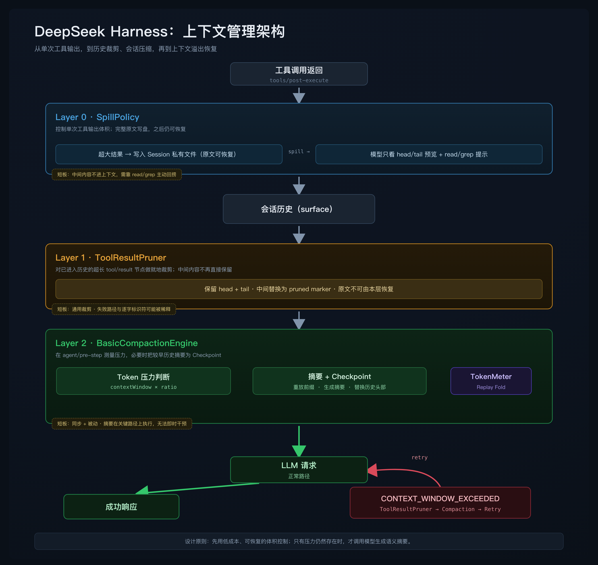

<div align="center">

# flowctx-dsh

**Context compression for DeepSeek Harness — memory that fades, instead of snapping.**

面向 [DeepSeek Harness](https://github.com/deepseek-ai/harness) 的本地优先上下文引擎：当前任务原文保留，临近历史可逆压缩，更早历史折叠成工程师交接笔记 —— 关键材料始终可恢复。

[](./LICENSE)
[](./package.json)
[](https://github.com/deepseek-ai/harness)
[](#开发)

[核心能力](#核心能力) · [为什么需要它](#为什么需要它) · [集成架构](#dsh-原生集成) · [安装](#安装) · [配置](#配置) · [评测](#评测) · [流程演示](https://ayou-claw.github.io/flowctx-dsh/docs/flow-demo-zh.html)

</div>

---

> [!TIP]
> **一句话理解**：flowctx-dsh 不把上下文当成"装满就截断"的缓冲区，而是把一次 AI 编程会话看成一段有纵深的工作记忆 —— **越近的信息越清晰，越远的信息越凝练，但不真正遗忘**。

它在 `dsh-compaction-basic` 之上做加性扩展：完整继承压力检测、范围选择、KV-cache 重放、事务管理与溢出恢复，只把"通用摘要"换成面向软件工程的交接笔记，并新增三条能力。**全部扩展可逐项开关；全关时行为等同于换了摘要风格的 `dsh-compaction-basic`。**

---

## 核心能力

flowctx-dsh 提供四项能力，覆盖工具结果返回 → 历史折叠 → 主动取回 → 工作记忆的完整链路：

| # | 能力 | Hook / 触发点 | 作用 | 默认 |
|:-:|------|--------------|------|:----:|
| 1 | **工程师交接笔记摘要** | `agent/pre-step`（替换提示词） | 摘要输出 6 段式交接笔记，专节保留失败路径与逐字标识符，而非通用叙述 | ✅ 开 |
| 2 | **分层 DAG 摘要** | `agent/pre-step`（另挂一条） | 历史后台 fire-and-forget 折叠成分层 summary nodes（leaf 折叠 + condense 逐级压缩），不阻塞关键路径 | ✅ 开 |
| 3 | **可逆工具结果投影** | `tools/post-execute` | 超阈值 tool result 结构化压缩，原文按 hash 存入 CompressionStore，可 byte-exact 取回 | ✅ 开 |
| 4 | **可编辑工作记忆** | `flowctx_scratch_*` 工具 | 模型自维护的 `<working_memory>` 块，注入进入 LLM 的消息流 | ⚪ 关 |

配套工具 **`flowctx_retrieve`**：按 `hash` 取回被投影压缩的原文，或按 `node` id 取回某一层交接笔记。

<details>
<summary><b>展开：每项能力的设计要点</b></summary>

### 1 · 工程师交接笔记摘要
通用摘要倾向保留"成功方向"，把已排除的路线一笔带过，导致 agent 重走弯路；session id / commit hash / 函数名 / 文件路径也常被改写成自然语言，引用时出错。交接笔记用固定 6 段结构把这些**专节保留**（详见[交接笔记格式](#工程师交接笔记格式)）。

### 2 · 分层 DAG 摘要（后台异步）
与 DSH 原生 Layer 2 的**同步**压缩不同：`agent/pre-step` 只做一次纯函数规划，真正的摘要 LLM 调用在关键路径之外异步执行，不阻塞当前步骤。同一会话若在摘要途中再次触发，旧任务被 generation 计数器 + `AbortController` 主动取代，避免重复劳动。每个 active summary node 作为独立 placeholder 注入，早期话题各占一块，而非被单条滚动摘要稀释。

### 3 · 可逆工具结果投影
结构化压缩不是删减：原文存本地 CompressionStore，上下文里留带 hash 的 marker。大段日志、大文件片段、失败尝试都能折叠，需要时 `flowctx_retrieve(hash="…")` byte-exact 取回。压缩只是 `assemble()` 阶段的**读时投影**，不破坏真实会话，宿主 transcript 始终保留未压缩原文。

### 4 · 可编辑工作记忆 scratchpad
开启后注册 `flowctx_scratch_append` / `_replace` / `_rethink` 三个工具，模型可主动维护一块 `<working_memory>`（当前目标、待办、不可遗忘的关键结果），每步注入回消息流。配置 `stateDir` 后随其他两个存储一并落盘，重启可恢复。

</details>

---

## 为什么需要它

让 AI Agent 处理复杂代码任务时，常见的失败模式是：聊到后面上下文越来越长、工具输出越来越多，agent 开始**重复搜索、忘记约束、重走已排除的路线**。这通常不是"模型不聪明"，而是上下文窗口管理出了问题。

DeepSeek Harness 已内置三层递进的上下文管理机制：



这三层能处理大多数场景，但在高强度 coding agent 工作流中各有短板 —— flowctx-dsh 针对性地补上：

| DSH 原生短板 | flowctx-dsh 的应对 |
|-------------|-------------------|
| **Layer 1** 就地裁剪 head/tail，中间内容**永久丢失**，关键错误行/函数定义可能一起消失 | 能力 3：投影前先把原文存 CompressionStore，可逆取回 |
| **Layer 2** 通用摘要丢失**失败路径**与**逐字标识符**，工具噪音稀释焦点 | 能力 1：交接笔记专节保留失败路径 + 逐字标识符 |
| **Layer 2** 在 `pre-step` **同步阻塞**，长历史每次触发都在关键路径插入一次完整 LLM 请求 | 能力 2：分层摘要后台 fire-and-forget，不阻塞 |
| **Layer 2** 触发**被动兜底**，无法在工具结果刚返回时干预 | 能力 3：`tools/post-execute` 即时结构化投影 |

> 软件工程任务里的"早期信息"并不一定过时：一条错误日志、一个函数签名、一个失败 patch、一个隐藏约束，都可能是后续修复的关键。**记忆应当渐远，而不是骤断。**

---

## 三档记忆模型

flowctx-dsh 按信息与当前任务的距离，把上下文分成三档：

| 记忆层级 | 处理方式 | 目标 |
|---------|---------|------|
| **当前任务** | 原文保留 | 刚读到的代码、刚运行的测试、最新需求不丢失 |
| **临近历史** | 结构化压缩（能力 3） | 大段工具输出压缩成可恢复引用 |
| **更早历史** | 后台摘要（能力 1+2） | 折叠成分层交接笔记，保留失败路径与关键标识符 |

**当前正在做的事永远不被压缩** —— agent 刚获得的代码片段、错误输出会原样进入模型，避免"刚看完就忘"；离当前更远的内容才被确定性投影或摘要折叠，既省 token 又保留可恢复路径。

### KV-cache 友好

长上下文不仅更贵，也拖慢推理。flowctx-dsh 在三个目标间平衡，尽量维持字节稳定的 KV-cache 前缀：

1. 当前任务的原始材料直接可用；
2. 历史材料可压缩、可恢复、可审计；
3. 上下文前缀尽可能稳定，照顾缓存命中（确定性压缩、分层折叠、读时投影，避免反复重写）。

---

## DSH 原生集成

标 `[+]` 的是 flowctx-dsh 在 DSH 三道防线之上新增的能力：

```
工具调用返回
    │
    ▼
[第一道] SpillPolicy          超大 tool result → 写磁盘，替换为 head/tail 预览
    │
    ▼
[第二道] ToolResultPruner     超长历史 tool/result 节点 → head+tail 裁剪，中间标记
    │
    ▼
[+] tools/post-execute        能力 3：超阈值 tool result → 可逆结构化投影，
    │                          原文写入 CompressionStore（内存 + 可选 SQLite），
    │                          上下文里留带 hash 的 marker
    ▼
[第三道] BasicCompactionEngine
    │   agent/pre-step：历史 token 超阈值 → LLM 摘要
    │                                           ↑
    │                              能力 1：替换此处的摘要提示词
    │                              → 输出工程师交接笔记而非通用摘要
    │
[+] agent/pre-step（另挂一条 hook）
    │   能力 2：纯函数规划分层 DAG 摘要 → 后台 fire-and-forget drain
    │   （leaf 折叠 + condense 逐级压缩，summary nodes 可选持久化到 SQLite）
    │   能力 4：把 <working_memory> scratchpad 注入进入消息流
    │   → 把 active summary node 作为 placeholder 注入
    ▼
LLM 请求

[+] 工具：flowctx_retrieve      按 hash 取回压缩原文，或按 node id 取回某层交接笔记
    可选 flowctx_scratch_*      能力 4：模型可编辑的 working memory
```

---

## 工程师交接笔记格式

摘要不再是通用叙述，而是固定 6 段结构：

```
## TASK / GOAL          当前任务与目标
## WORKING APPROACHES    有效路径
## FAILED APPROACHES     已排除的路线（专节，防止重走弯路）
## KEY IDENTIFIERS       session id / commit hash / 函数名（逐字保留）
## FILE ARTIFACTS        涉及的文件路径（显式列出）
## OPEN STATE            当前未决状态
```

| 维度 | 通用摘要 | 工程师交接笔记 |
|------|---------|---------------|
| 失败路径 | 通常丢弃 | **专节保留**（FAILED APPROACHES） |
| 精确标识符 | 改写为描述 | **逐字保留**（KEY IDENTIFIERS） |
| 文件路径 | 可能省略 | **显式列出**（FILE ARTIFACTS） |
| 当前状态 | 混入主体 | **专节提炼**（OPEN STATE） |

若被压缩历史中已存在一条 checkpoint，本次摘要会自动合并，保持单层结构。

---

## 评测

### OpenClaw 版（已有数据）

数据来自 [flowctx（OpenClaw 版）](https://github.com/Ayou-Claw/flowctx) 在 SWE-bench Verified 上的评测（确定性挑选 40 题，覆盖 12 个仓库、跨 3 档难度；对照是共享会话下开启/关闭 flowctx）：

| 配置 | 解决率 | 平均分 | KV 命中率 | 总 token/题 |
|------|:-----:|:------:|:--------:|:----------:|
| flowctx **off** · 共享 | 68% | 71.1 | 96.1% | 288k |
| flowctx **on** · 共享 | 68% | 71.8 | 93.9% | **127k** |

> 解决率保持 68% 不变，平均每题 token 从 288k 降到 **127k（↓约 56%）**。

目标不是"压缩后让模型神奇变强"，而是在不明显牺牲任务质量的前提下，让长会话 Agent **更省、更稳、更少重复劳动**。

📊 交互式图表（OpenClaw 版）：<https://ayou-claw.github.io/flowctx/data/bench/flowctx_bench_zh.html>

### DSH 版（进行中）

DSH 版的 SWE-bench 评测正在进行，结果将在此更新。

---

## 安装

### 方式一：dsh plugin 命令（推荐）

```bash
# 安装到 web profile（headless / tui 同理，换 --profile 参数）
dsh plugin --profile web add flowctx-dsh
```

将插件加入 profile 的 patch 层：

```yaml
# ~/.dsh/profiles/web/cordis.patch.yml
- insert:
    - id: flowctx-dsh
      name: flowctx-dsh
```

重启：`dsh web`

### 方式二：本地开发版

```bash
git clone https://github.com/Ayou-Claw/flowctx-dsh
cd flowctx-dsh && npm install && npm run build
dsh plugin --profile web add /绝对路径/flowctx-dsh
```

之后同样编辑 `cordis.patch.yml` 加入上述 `insert:` 块。

### 验证加载

```bash
dsh --profile web --dump-config | grep flowctx
```

---

## 配置

所有配置项可选，未配置时行为等同 `dsh-compaction-basic`（仅摘要风格不同）。

```yaml
# ~/.dsh/profiles/web/cordis.patch.yml
- insert:
    - id: flowctx-dsh
      name: flowctx-dsh
      config:
        # —— 摘要（能力 1）——
        summarizationProvider: ''   # 默认跟随 agent 当前路由
        summarizationModel: ''
        summaryMaxTokens: 0         # 摘要 token 上限，0 = 不限
        thresholdRatio: 0.8         # 压缩触发阈值
        retainRatio: 0.16           # 保留尾部比例

        # —— 分层 DAG 摘要（能力 2，默认开）——
        layeredSummary: true        # 后台折叠成分层 summary nodes

        # —— 可逆投影（能力 3，默认开）——
        projection: true            # 超阈值 tool result 结构化压缩
        projectionThreshold: 1000   # 触发投影的 token 阈值

        # —— 工作记忆 scratchpad（能力 4，默认关）——
        scratchpad: false           # 开启后注册 flowctx_scratch_* 三个工具
        scratchpadMaxChars: 8000

        # —— SQLite 持久化（可选）——
        # 设置后，压缩引用、summary nodes 与 scratchpad 三者共用一个
        # 数据库句柄落盘到 <stateDir>/flowctx.sqlite，进程重启后可恢复；
        # 不设置则退化为纯内存 + TTL（会话内可恢复）。
        stateDir: ~/.dsh/profiles/web/flowctx-state
```

完整配置项继承自 `dsh-compaction-basic`，详见 [`src/config.ts`](./src/config.ts)。

---

## 设计属性

flowctx-dsh 是一套**可检查、可调参、可恢复**的上下文管理层，而非黑盒记忆插件：

- **本地优先 · 可恢复** — 压缩引用存本地 CompressionStore（内存 + TTL 热缓存）；配置 `stateDir` 后，压缩引用、分层 summary nodes 与 scratchpad 一并持久化到 `<stateDir>/flowctx.sqlite`，内存未命中回落 SQLite 并回填热缓存。
- **单句柄共享** — refs / summary-nodes / scratchpad 三个命名空间共用一个 SQLite 句柄，避免同一文件多句柄的并发写风险。
- **不破坏真实会话** — 不改写宿主 transcript；摘要是加性的 `<flowctx-handoff-note>`；压缩仅发生在读时投影。
- **不阻塞关键路径** — 分层摘要后台 fire-and-forget 执行。
- **完整兜底** — `BasicCompactionEngine` 的压力检测、事务管理、溢出恢复等逻辑全部保留。
- **可主动取回** — `flowctx_retrieve` 让 agent 按 hash 取回压缩原文，或按 node id 取回某层交接笔记（重启后从 SQLite 读）。

---

## 适合谁

- 正在用 DSH 构建 AI 编程 Agent；
- 经常跑长会话、多文件、多阶段代码任务；
- 工具输出多、prompt token 持续膨胀；
- 不想用"一刀切截断"牺牲工程上下文；
- 需要本地优先、可审计、可恢复的上下文机制；
- 想研究 Agent 工作记忆、上下文压缩、KV-cache 友好投影。

---

## 开发

```bash
npm install       # 安装开发依赖
npm run typecheck # 类型检查
npm test          # 运行测试（无需外部凭据，129 passing）
npm run build     # esbuild → lib/index.js
```

---

## 相关链接

- **DSH 版（本项目）**：<https://github.com/Ayou-Claw/flowctx-dsh>
- **OpenClaw 原版**：<https://github.com/Ayou-Claw/flowctx>
- **流程演示**：<https://ayou-claw.github.io/flowctx-dsh/docs/flow-demo-zh.html>

> AI Agent 的能力，不只取决于模型本身，也取决于它如何管理自己的工作记忆。flowctx-dsh 给 DSH 提供了一种更工程化的答案：当前任务保持清晰，临近历史结构化压缩，更早历史形成交接笔记，所有关键材料仍可恢复。

## 许可证

[MIT](./LICENSE)
