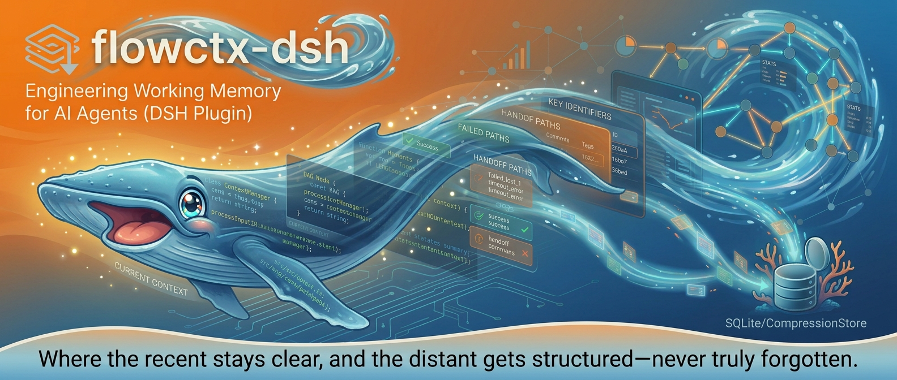

<div align="center">



# flowctx-dsh

面向 [DeepSeek Harness](https://github.com/deepseek-ai/harness) 的本地优先上下文引擎。当前任务保留原文，临近历史可逆压缩，更早历史折叠为工程师交接笔记，关键材料始终可恢复。

[](./LICENSE)
[](./package.json)
[](https://github.com/deepseek-ai/harness)
[](#开发)

[核心能力](#核心能力) · [为什么需要它](#为什么需要它) · [三档记忆模型](#三档记忆模型) · [集成架构](#dsh-原生集成) · [评测](#评测) · [安装](#安装) · [配置](#配置) · [适用场景](#适用场景) · [流程演示](https://ayou-claw.github.io/flowctx-dsh/docs/flow-demo-zh.html)

</div>

---

> [!TIP]
> **核心理念**：flowctx-dsh 不把上下文视为「装满即截断」的缓冲区，而是将一次 AI 编程会话看作一段有纵深的工作记忆——**越近的信息越清晰，越远的信息越凝练，但均不被真正遗忘**。

flowctx-dsh 在 `dsh-compaction-basic` 之上做加性扩展：完整继承其压力检测、范围选择、KV-cache 重放、事务管理与溢出恢复能力，仅将「通用摘要」替换为面向软件工程的交接笔记，并新增三项能力。**所有扩展均可逐项开关；全部关闭时，其行为等同于仅调整了摘要风格的 `dsh-compaction-basic`。**

---

## 核心能力

flowctx-dsh 提供四项能力，覆盖「工具结果返回 → 历史折叠 → 主动取回 → 工作记忆」的完整链路：

| # | 能力 | Hook / 触发点 | 作用 | 默认 |
|:-:|------|--------------|------|:----:|
| 1 | **工程师交接笔记摘要** | `agent/pre-step`（替换提示词） | 摘要输出 6 段式交接笔记，专节保留失败路径与逐字标识符，而非通用叙述 | ✅ 开 |
| 2 | **分层 DAG 摘要** | `agent/pre-step`（另挂一条） | 历史后台 fire-and-forget 折叠成分层 summary nodes（leaf 折叠 + condense 逐级压缩），不阻塞关键路径 | ✅ 开 |
| 3 | **可逆工具结果投影** | `tools/post-execute` | 超阈值 tool result 结构化压缩，原文按 hash 存入 CompressionStore，可 byte-exact 取回 | ✅ 开 |
| 4 | **可编辑工作记忆** | `flowctx_scratch_*` 工具 | 模型自维护的 `<working_memory>` 块，注入进入 LLM 的消息流 | ⚪ 关 |

配套工具 **`flowctx_retrieve`**：按 `hash` 取回被投影压缩的原文，或按 `node` id 取回指定层级的交接笔记。

<details>
<summary><b>展开查看：各项能力的设计要点</b></summary>

### 1 · 工程师交接笔记摘要
通用摘要倾向于保留「成功方向」，对已排除的路线一笔带过，易导致 Agent 重走弯路；session id、commit hash、函数名、文件路径等也常被改写为自然语言，引用时出错。交接笔记以固定 6 段结构对这些信息**分节保留**（详见[交接笔记格式](#工程师交接笔记格式)）。

### 2 · 分层 DAG 摘要（后台异步）
与 DSH 原生 Layer 2 的**同步**压缩不同：`agent/pre-step` 仅执行一次纯函数规划，真正的摘要 LLM 调用在关键路径之外异步执行，不阻塞当前步骤。同一会话若在摘要过程中再次触发，旧任务将由 generation 计数器与 `AbortController` 主动取代，避免重复计算。每个 active summary node 作为独立 placeholder 注入，使早期话题各占一节，而非被单条滚动摘要稀释。

### 3 · 可逆工具结果投影
结构化压缩并非删减：原文存入本地 CompressionStore，上下文中仅保留带 hash 的 marker。大段日志、大文件片段、失败尝试均可折叠，需要时通过 `flowctx_retrieve(hash="…")` 按字节精确（byte-exact）取回。压缩仅发生在 `assemble()` 阶段的**读时投影**，不破坏真实会话，宿主 transcript 始终保留未压缩原文。

### 4 · 可编辑工作记忆 scratchpad
开启后注册 `flowctx_scratch_append`、`_replace`、`_rethink` 三个工具，模型可主动维护一块 `<working_memory>`（记录当前目标、待办事项、不可遗忘的关键结果），并在每步注入回消息流。配置 `stateDir` 后随其余两类存储一并落盘，进程重启后可恢复。

</details>

---

## 为什么需要它

AI Agent 处理复杂代码任务时，一种常见的失败模式是：随着对话推进，上下文不断变长、工具输出不断累积，Agent 开始**重复搜索、遗忘约束、重走已排除的路线**。这通常并非「模型能力不足」，而是上下文窗口管理出现了问题。

DeepSeek Harness 已内置三层递进的上下文管理机制：


这三层能处理大多数场景，但在高强度 coding agent 工作流中各有短板 —— flowctx-dsh 针对性地补上：

| DSH 原生短板 | flowctx-dsh 的应对 |
|-------------|-------------------|
| **Layer 1** 就地裁剪 head/tail，中间内容**永久丢失**，关键错误行/函数定义可能一起消失 | 能力 3：投影前先把原文存 CompressionStore，可逆取回 |
| **Layer 2** 通用摘要丢失**失败路径**与**逐字标识符**，工具噪音稀释焦点 | 能力 1：交接笔记专节保留失败路径 + 逐字标识符 |
| **Layer 2** 在 `pre-step` **同步阻塞**，长历史每次触发都在关键路径插入一次完整 LLM 请求 | 能力 2：分层摘要后台 fire-and-forget，不阻塞 |
| **Layer 2** 触发**被动兜底**，无法在工具结果刚返回时干预 | 能力 3：`tools/post-execute` 即时结构化投影 |

> 软件工程任务中的「早期信息」未必已经过时：一条错误日志、一个函数签名、一次失败的 patch、一项隐藏约束，都可能是后续修复的关键。**记忆应当渐远，而非骤断。**

---

## 三档记忆模型

flowctx-dsh 按信息与当前任务的距离，把上下文分成三档：

| 记忆层级 | 处理方式 | 目标 |
|---------|---------|------|
| **当前任务** | 原文保留 | 刚读到的代码、刚运行的测试、最新需求不丢失 |
| **临近历史** | 结构化压缩（能力 3） | 大段工具输出压缩成可恢复引用 |
| **更早历史** | 后台摘要（能力 1+2） | 折叠成分层交接笔记，保留失败路径与关键标识符 |

**当前正在进行的工作永不被压缩**——Agent 刚获取的代码片段、错误输出会原样进入模型，避免「刚读完即遗忘」；只有距离当前更远的内容，才会被确定性投影或摘要折叠，从而在节省 token 的同时保留可恢复路径。

### KV-cache 友好

长上下文不仅成本更高，也会拖慢推理。flowctx-dsh 在以下三个目标间取得平衡，尽可能维持字节稳定的 KV-cache 前缀：

1. 当前任务的原始材料可直接使用；
2. 历史材料可压缩、可恢复、可审计；
3. 上下文前缀尽可能稳定，以提升缓存命中率（采用确定性压缩、分层折叠、读时投影，避免反复重写）。

---

## DSH 原生集成

以下流程中，标注 `[+]` 者为 flowctx-dsh 在 DSH 三道防线之上新增的能力：

```
工具调用返回
    │
    ▼
[第一道] SpillPolicy          超大 tool result → 写磁盘，替换为 head/tail 预览
    │
    ▼
[第二道] ToolResultPruner     超长历史 tool/result 节点 → head+tail 裁剪，中间标记
    │
    ▼
[+] tools/post-execute        能力 3：超阈值 tool result → 可逆结构化投影，
    │                          原文写入 CompressionStore（内存 + 可选 SQLite），
    │                          上下文里留带 hash 的 marker
    ▼
[第三道] BasicCompactionEngine
    │   agent/pre-step：历史 token 超阈值 → LLM 摘要
    │                                           ↑
    │                              能力 1：替换此处的摘要提示词
    │                              → 输出工程师交接笔记而非通用摘要
    │
[+] agent/pre-step（另挂一条 hook）
    │   能力 2：纯函数规划分层 DAG 摘要 → 后台 fire-and-forget drain
    │   （leaf 折叠 + condense 逐级压缩，summary nodes 可选持久化到 SQLite）
    │   能力 4：把 <working_memory> scratchpad 注入进入消息流
    │   → 把 active summary node 作为 placeholder 注入
    ▼
LLM 请求

[+] 工具：flowctx_retrieve      按 hash 取回压缩原文，或按 node id 取回某层交接笔记
    可选 flowctx_scratch_*      能力 4：模型可编辑的 working memory
```

---

## 工程师交接笔记格式

摘要不再是通用叙述，而是采用固定的 6 段结构：

```
## TASK / GOAL          当前任务与目标
## WORKING APPROACHES    有效路径
## FAILED APPROACHES     已排除的路线（专节，防止重走弯路）
## KEY IDENTIFIERS       session id / commit hash / 函数名（逐字保留）
## FILE ARTIFACTS        涉及的文件路径（显式列出）
## OPEN STATE            当前未决状态
```

| 维度 | 通用摘要 | 工程师交接笔记 |
|------|---------|---------------|
| 失败路径 | 通常丢弃 | **专节保留**（FAILED APPROACHES） |
| 精确标识符 | 改写为描述 | **逐字保留**（KEY IDENTIFIERS） |
| 文件路径 | 可能省略 | **显式列出**（FILE ARTIFACTS） |
| 当前状态 | 混入主体 | **专节提炼**（OPEN STATE） |

若被压缩的历史中已存在一条 checkpoint，本次摘要将自动与其合并，以保持单层结构。

---

## 评测

### OpenClaw 版（已有数据）

以下数据来自 [flowctx（OpenClaw 版）](https://github.com/Ayou-Claw/flowctx) 在 SWE-bench Verified 上的评测（确定性抽取 40 题，覆盖 12 个仓库、跨 3 档难度；对照组为共享会话下开启与关闭 flowctx）：

| 配置 | 解决率 | 平均分 | KV 命中率 | 总 token/题 |
|------|:-----:|:------:|:--------:|:----------:|
| flowctx **关闭** · 共享 | 68% | 71.1 | 96.1% | 288k |
| flowctx **开启** · 共享 | 68% | 71.8 | 93.9% | **127k** |

> 解决率维持 68% 不变，平均每题 token 从 288k 降至 **127k（下降约 56%）**。

其目标并非「压缩后使模型能力凭空提升」，而是在不明显牺牲任务质量的前提下，使长会话 Agent **更省、更稳、更少重复计算**。

交互式图表（OpenClaw 版）：<https://ayou-claw.github.io/flowctx/data/bench/flowctx_bench_zh.html>

### DSH 版（进行中）

DSH 版的 SWE-bench 评测正在进行中，结果将在此处更新。

---

## 安装

### 方式一：dsh plugin 命令（推荐）

```bash
# 安装到 web profile（headless / tui 同理，换 --profile 参数）
dsh plugin --profile web add flowctx-dsh
```

**这一步就够了。** `dsh plugin add` 会把 flowctx-dsh 写入 profile 的
`dsh.profile.bundles` 列表；随后 dsh 会自动应用本插件自带的 bundle patch
（仓库根 [`cordis.patch.yml`](./cordis.patch.yml)）——它 insert flowctx-dsh 并
disable 内置 `compaction-basic`（因为 flowctx-dsh **接管 (OWNS)** `compaction` 服务）。

> ⚠️ **不要**再手动往 `~/.dsh/profiles/<p>/cordis.patch.yml` 里加 `- insert: flowctx-dsh`。
> bundle patch 已经 insert 过一次，手动再 insert 会造成**重复 insert**，dsh 启动直接报错。
> profile 的 `cordis.patch.yml` 只用来做**配置覆盖**（见下方「配置」），不用于 insert。

重启：`dsh web`。卸载 / 回落内置引擎：`dsh plugin --profile web remove flowctx-dsh`
（从 bundles 移除后，compaction-basic 自动恢复）。

### 方式二：本地开发版

```bash
git clone https://github.com/Ayou-Claw/flowctx-dsh
cd flowctx-dsh && npm install && npm run build
dsh plugin --profile web add /绝对路径/flowctx-dsh
```

同样地，`dsh plugin add` 已完成挂载，无需手动编辑 `insert:` 块。

### 验证加载

```bash
dsh --profile web --dump-config | grep flowctx
```

---

## 配置

所有配置项均为可选；未配置时，其行为等同于 `dsh-compaction-basic`（仅摘要风格不同）。

插件本身已由 bundle patch 挂载（见「安装」），要**覆盖配置**，在 profile 的
`cordis.patch.yml` 里对 `flowctx-dsh` 做 **config override**（`- id:` 而非 `- insert:`，
避免重复 insert）：

```yaml
# ~/.dsh/profiles/web/cordis.patch.yml
- id: flowctx-dsh
  config:
    # —— 摘要（能力 1）——
    summarizationProvider: ''   # 默认跟随 agent 当前路由
    summarizationModel: ''
    summaryMaxTokens: 0         # 摘要 token 上限，0 = 不限
    thresholdRatio: 0.8         # 压缩触发阈值（大窗口模型可调低以更早触发摘要）
    retainRatio: 0.16           # 保留尾部比例（必须 < thresholdRatio）

    # —— 分层 DAG 摘要（能力 2，默认开）——
    layeredSummary: true        # 后台折叠成分层 summary nodes

    # —— 可逆投影（能力 3，默认开）——
    projection: true            # 超阈值 tool result 结构化压缩
    projectionThreshold: 1000   # 触发投影的 token 阈值

    # —— 工作记忆 scratchpad（能力 4，默认关）——
    scratchpad: false           # 开启后注册 flowctx_scratch_* 三个工具
    scratchpadMaxChars: 8000

    # —— SQLite 持久化（可选）——
    # 设置后，压缩引用、summary nodes 与 scratchpad 三者共用一个
    # 数据库句柄落盘到 <stateDir>/flowctx.sqlite，进程重启后可恢复；
    # 不设置则退化为纯内存 + TTL（会话内可恢复）。
    stateDir: ~/.dsh/profiles/web/flowctx-state
```

完整配置项继承自 `dsh-compaction-basic`，详见 [`src/config.ts`](./src/config.ts)。

---

## 设计属性

flowctx-dsh 是一套**可检查、可调参、可恢复**的上下文管理层，而非黑盒式记忆插件：

- **本地优先，可恢复**——压缩引用存于本地 CompressionStore（内存 + TTL 热缓存）；配置 `stateDir` 后，压缩引用、分层 summary nodes 与 scratchpad 一并持久化至 `<stateDir>/flowctx.sqlite`，内存未命中时回落至 SQLite 并回填热缓存。
- **单句柄共享**——refs、summary-nodes、scratchpad 三个命名空间共用同一 SQLite 句柄，规避同一文件多句柄带来的并发写风险。
- **不破坏真实会话**——不改写宿主 transcript；摘要以加性方式写入 `<flowctx-handoff-note>`；压缩仅发生于读时投影。
- **不阻塞关键路径**——分层摘要以后台 fire-and-forget 方式执行。
- **完整兜底**——完整保留 `BasicCompactionEngine` 的压力检测、事务管理、溢出恢复等逻辑。
- **可主动取回**——`flowctx_retrieve` 允许 Agent 按 hash 取回压缩原文，或按 node id 取回指定层级的交接笔记（重启后自 SQLite 读取）。

---

## 适用场景

flowctx-dsh 适用于以下情形：

- 正在基于 DSH 构建 AI 编程 Agent；
- 频繁运行长会话、多文件、多阶段的代码任务；
- 工具输出量大，prompt token 持续膨胀；
- 不希望以「一刀切截断」的方式牺牲工程上下文；
- 需要本地优先、可审计、可恢复的上下文管理机制；
- 希望研究 Agent 工作记忆、上下文压缩与 KV-cache 友好的投影方案。

---

## 开发

```bash
npm install       # 安装开发依赖
npm run typecheck # 类型检查
npm test          # 运行测试（无需外部凭据，129 项通过）
npm run build     # esbuild → lib/index.js
```

---

## 相关链接

- **DSH 版（本项目）**：<https://github.com/Ayou-Claw/flowctx-dsh>
- **OpenClaw 原版**：<https://github.com/Ayou-Claw/flowctx>
- **流程演示**：<https://ayou-claw.github.io/flowctx-dsh/docs/flow-demo-zh.html>

> AI Agent 的能力不仅取决于模型本身，也取决于它如何管理自己的工作记忆。flowctx-dsh 为 DSH 提供了一种更工程化的答案：当前任务保持清晰，临近历史结构化压缩，更早历史形成交接笔记，所有关键材料始终可恢复。

## 许可证

[MIT](./LICENSE)
